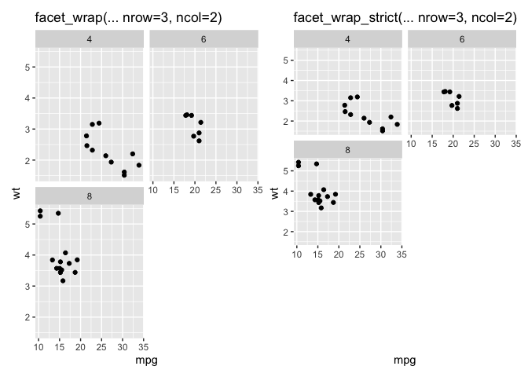
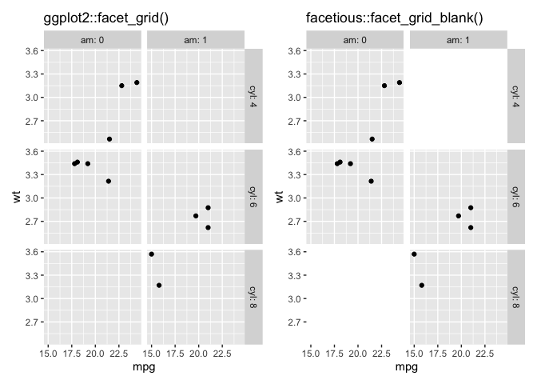

<!-- README.md is generated from README.Rmd. Please edit that file -->

# facetious

<!-- badges: start -->


<!-- badges: end -->

`facetious` is home to some alternate facetting options for `ggplot2`.

## What’s in the box

-   `facet_wrap_strict()`
    -   respects nrow, ncol and inserts empty grobs to keep the
        resultant plot at the given size
    -   Otherwise works like `ggplot2::facet_wrap()`
-   `facet_grid_blank()`
    -   When a factor level doesn’t exist, this facetting approach will
        insert a totally empty object, instead of just an empty plot
    -   Otherwise works like `ggplot2::facet_grid()`

## Installation

You can install from
[GitHub](https://github.com/coolbutuseless/facetious) with:

``` r
# install.package('remotes')
remotes::install_github('coolbutuseless/facetious')
```

## `facet_wrap_strict`

``` r
library(ggplot2)
library(patchwork)
library(facetious)

#~~~~~~~~~~~~~~~~~~~~~~~~~~~~~~~~~~~~~~~~~~~~~~~~~~~~~~~~~~~~~~~~~~~~~~~~~~~~~
# Standard ggplot2 facet_wrap()
#~~~~~~~~~~~~~~~~~~~~~~~~~~~~~~~~~~~~~~~~~~~~~~~~~~~~~~~~~~~~~~~~~~~~~~~~~~~~~
ggplot_facet_wrap <- ggplot(mtcars) +
  geom_point(aes(mpg, wt)) + 
  facet_wrap(~cyl, nrow = 3, ncol = 2) + 
  labs(title = "facet_wrap(... nrow=3, ncol=2)")

#~~~~~~~~~~~~~~~~~~~~~~~~~~~~~~~~~~~~~~~~~~~~~~~~~~~~~~~~~~~~~~~~~~~~~~~~~~~~~
# facetious::facet_wrap_strict
#~~~~~~~~~~~~~~~~~~~~~~~~~~~~~~~~~~~~~~~~~~~~~~~~~~~~~~~~~~~~~~~~~~~~~~~~~~~~~
facetious_facet_wrap_strict <- ggplot(mtcars) +
  geom_point(aes(mpg, wt)) + 
  facet_wrap_strict(~cyl, nrow = 3, ncol = 2) + 
  labs(title = "facet_wrap_strict(... nrow=3, ncol=2)")

#~~~~~~~~~~~~~~~~~~~~~~~~~~~~~~~~~~~~~~~~~~~~~~~~~~~~~~~~~~~~~~~~~~~~~~~~~~~~~
# Use 'patchwork' to stitch plots side-by-side
#~~~~~~~~~~~~~~~~~~~~~~~~~~~~~~~~~~~~~~~~~~~~~~~~~~~~~~~~~~~~~~~~~~~~~~~~~~~~~
ggplot_facet_wrap + facetious_facet_wrap_strict
```



## `facet_grid_blank`

``` r
library(dplyr)
library(ggplot2)
library(patchwork)
library(facetious)

#~~~~~~~~~~~~~~~~~~~~~~~~~~~~~~~~~~~~~~~~~~~~~~~~~~~~~~~~~~~~~~~~~~~~~~~~~~~~~
# Make some data with some empty factors
#~~~~~~~~~~~~~~~~~~~~~~~~~~~~~~~~~~~~~~~~~~~~~~~~~~~~~~~~~~~~~~~~~~~~~~~~~~~~~
plot_df <- mtcars %>%
  mutate(
    cyl = as.factor(cyl),
    am = as.factor(am)
  ) %>%
  filter(!(cyl == 4 & am == 1)) %>%
  filter(!(cyl == 8 & am == 0))

#~~~~~~~~~~~~~~~~~~~~~~~~~~~~~~~~~~~~~~~~~~~~~~~~~~~~~~~~~~~~~~~~~~~~~~~~~~~~~
# Standard ggplot facet_grid()
#~~~~~~~~~~~~~~~~~~~~~~~~~~~~~~~~~~~~~~~~~~~~~~~~~~~~~~~~~~~~~~~~~~~~~~~~~~~~~
ggplot_facet_grid <- ggplot(plot_df) +
  geom_point(aes(mpg, wt)) +
  facet_grid(rows = vars(cyl), cols = vars(am), drop = FALSE,
             labeller = label_both) +
  labs(title = "ggplot2::facet_grid()")

#~~~~~~~~~~~~~~~~~~~~~~~~~~~~~~~~~~~~~~~~~~~~~~~~~~~~~~~~~~~~~~~~~~~~~~~~~~~~~
# facetious::facet_grid_blank()
#~~~~~~~~~~~~~~~~~~~~~~~~~~~~~~~~~~~~~~~~~~~~~~~~~~~~~~~~~~~~~~~~~~~~~~~~~~~~~
facetious_facet_grid_blank <- ggplot(plot_df) +
  geom_point(aes(mpg, wt)) +
  facet_grid_blank(rows = vars(cyl), cols = vars(am), drop = FALSE, 
                   labeller = label_both) +
  labs(title = "facetious::facet_grid_blank()")

#~~~~~~~~~~~~~~~~~~~~~~~~~~~~~~~~~~~~~~~~~~~~~~~~~~~~~~~~~~~~~~~~~~~~~~~~~~~~~
# Use 'patchwork' to stitch plots side-by-side
#~~~~~~~~~~~~~~~~~~~~~~~~~~~~~~~~~~~~~~~~~~~~~~~~~~~~~~~~~~~~~~~~~~~~~~~~~~~~~
ggplot_facet_grid + facetious_facet_grid_blank
```



## Related Software

-   [ggplot2](https://cran.r-project.org/package=ggplot2)
-   [ggforce](https://cran.r-project.org/package=ggforce)

## Acknowledgements

-   R Core for developing and maintaining the language.
-   CRAN maintainers, for patiently shepherding packages onto CRAN and
    maintaining the repository
